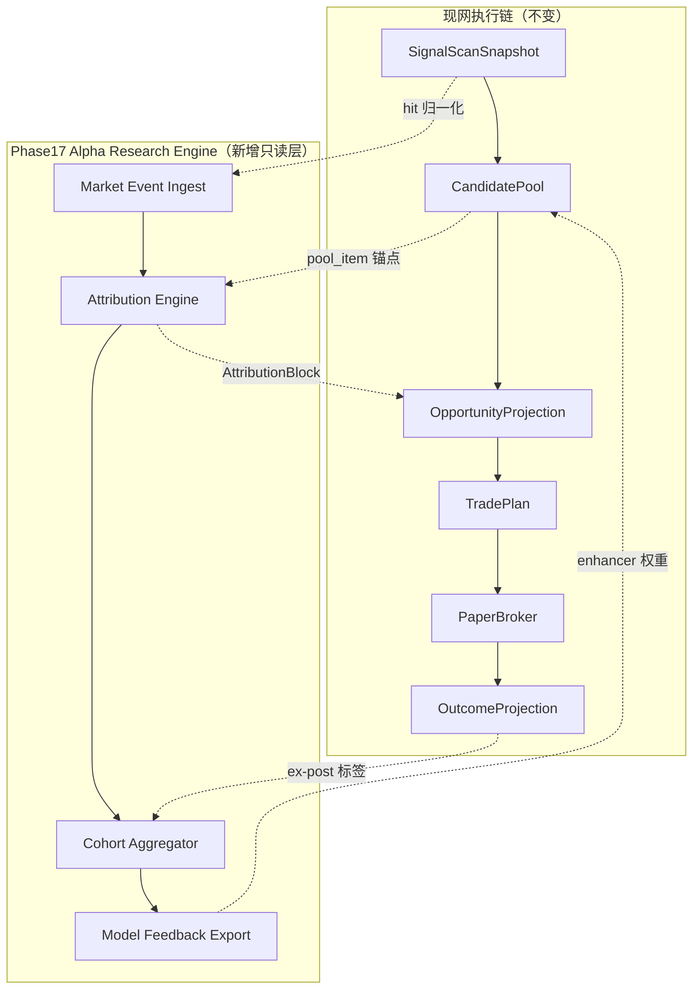
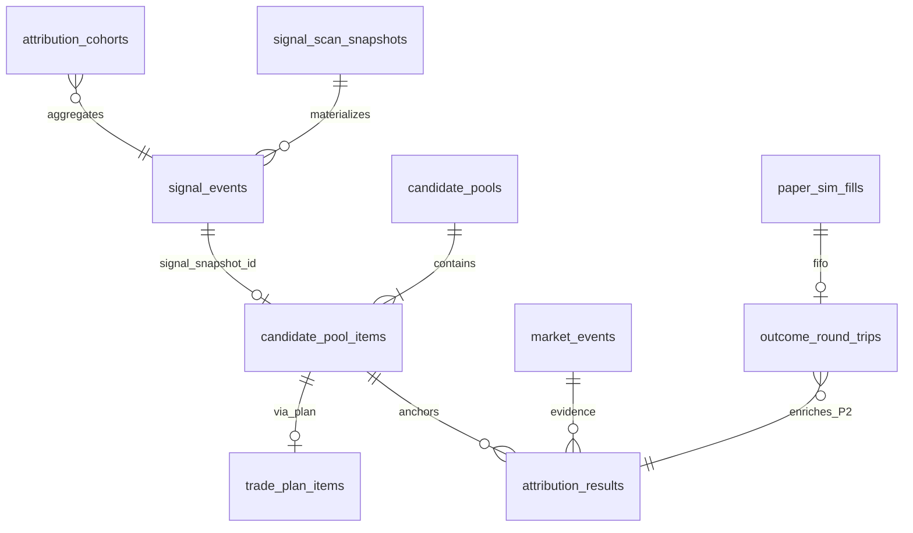
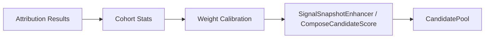

# Phase17 Alpha Research Engine 预研设计

**文档类型**：预研设计（Pre-research）  
**日期**：2026-09-02  
**性质**：**只设计，不实现**  
**目标问题**：**为什么股票涨？** —— 在历史事件维度给出 **可解释、可分类、可统计** 的归因，并反哺选股模型。

**依据**：
- [PHASE16_0_INVESTMENT_DECISION_CLOSED_LOOP_AUDIT.md](PHASE16_0_INVESTMENT_DECISION_CLOSED_LOOP_AUDIT.md)（决策执行闭环）
- [PHASE17_A_ALPHA_RESEARCH_CAPABILITY_AUDIT.md](PHASE17_A_ALPHA_RESEARCH_CAPABILITY_AUDIT.md)（Alpha 数据能力缺口）
- 现网读模型：`OpportunityProjection` · `OutcomeProjection` · `CandidatePool`

---

## 0. 执行摘要

| 维度 | 设计结论 |
|------|----------|
| **系统定位** | **Alpha Research Engine（ARE）** = 在现有 **Execution/Observation 闭环之上** 的 **只读研究层**；回答「涨因」而非「是否该买」 |
| **核心产物** | **Historical Event Attribution（HEA）** —— 对 `(stock_code, trade_date, window)` 输出 **多因子归因标签 + 证据链 + 置信度** |
| **五类归因** | 新闻事件 · 技术突破 · 资金流 · 板块联动 · 市场情绪（可并存，主因 + 辅因） |
| **与 CandidatePool 关系** | **Pool Item 为研究锚点**（`pool_id` + `signal_snapshot_id`）；归因 **不修改** Score/Rank |
| **反哺路径** | 归因 cohort 统计 → **Signal/Pool 权重校准** → `BuildCandidatePool` 增强器输入 |
| **MVP** | 技术突破 + 板块联动（现网数据可支撑）+ 事件物化表 + 只读 API；新闻/情绪/资金流 **规则版** |



---

## 1. 问题定义与边界

### 1.1 「为什么股票涨」在本系统中的含义

| 用户问法 | 系统应回答 | 不应冒充 |
|----------|------------|----------|
| 今天为什么涨？ | 在 **事件窗口** 内，哪类 **可观测因子** 与涨幅 **共现**，证据是什么 | 因果定论、「必然涨因」 |
| 这类信号以前有效吗？ | 按 `signal_tag` / 归因类 cohort 的 **历史 forward return** | 单笔 outcome 代表全体 |
| 和板块有关系吗？ | 同行业/概念 **相对强度**、龙头带动证据 | 无板块数据时的臆测 |

**时间窗约定（默认）**：

- **Discovery 窗**：`signal_time` 当日 `[T-1, T+1]`（发现前后各一交易日）
- **Outcome 窗**：`entry_date` → `exit_date`（OutcomeProjection leg）
- **Research 窗**：用户可选 `T+1` / `T+5` / `T+20` forward return（cohort 用）

### 1.2 五类归因定义（Phase17 分类体系）

| 类别 | 代码 | 判定直觉 | 现网可支撑证据（MVP） |
|------|------|----------|------------------------|
| **1. 新闻事件驱动** | `NEWS_EVENT` | 窗口内存在 **高相关新闻** 且 sentiment 与涨跌方向一致 | `MarketNewsApi`（财联社等）；标题关键词 |
| **2. 技术突破** | `TECH_BREAKOUT` | 价格/量突破 + 系统 **signal_tag** 命中 | `SignalScanHit.tag`, RSI, VOLUME_RATIO, signal_price |
| **3. 资金流驱动** | `CAPITAL_FLOW` | 主力/大单净流入与涨幅同向 | `GetStockHistoryMoneyData`；hit.DEAL_AMOUNT 变化 |
| **4. 板块联动** | `SECTOR_LINKAGE` | 个股涨幅 **落后于** 板块/概念涨幅 → 补涨；或 **领先** 板块 → 龙头 | hit.INDUSTRY/CONCEPT；sector 指数相对强度 |
| **5. 市场情绪** | `MARKET_SENTIMENT` | 大盘/全市场涨跌与个股 **同步**；或情绪词典得分极端 | 指数涨跌；`AnalyzeSentiment`；涨跌家数（若接入） |

**输出结构（每条归因）**：

```json
{
  "category": "TECH_BREAKOUT",
  "role": "primary",
  "confidence": 0.72,
  "summary": "收盘扫描命中「强」标签，量比>2，突破前高",
  "evidence": [
    { "type": "signal_tag", "ref": "强", "snapshot_id": 301125 },
    { "type": "volume_ratio", "value": 2.3, "threshold": 1.5 }
  ],
  "window": { "start": "2026-08-28", "end": "2026-08-28" }
}
```

---

## 2. 现网资产与缺口（设计基线）

### 2.1 已有闭环（可复用锚点）

| 阶段 | 实体 | 研究锚点字段 | 现网能力 |
|------|------|--------------|----------|
| Signal | `SignalScanSnapshot` + hits(JSON) | `snapshot_id`, `tag`, `signal_price/time`, `INDUSTRY` | 发现 **what**，非 **why rise** |
| Opportunity | `CandidatePoolItem` | `pool_id`, `rank`, `score`, `signal_snapshot_id`, `signal_tag` | **权威横截面** |
| Projection | `OpportunityProjection` | 五层 + 可选 `ResearchBlock` | 解释决策链，无涨跌归因 |
| Plan | `TradePlan` / items | `pool_id`, `strategy_name` | 执行溯源 |
| Paper | `PaperSimFill` | `plan_id`, fills | 成交事实 |
| Outcome | `OutcomeProjection` | FIFO leg, `realized_return_pct` | **ex-post 结果**，无涨因 |

### 2.2 已有孤立数据（待接线）

| 模块 | 路径 | 状态 |
|------|------|------|
| 新闻 | `backend/data/market_news_api.go` | 有 API，**未进** projection |
| 情绪 | `backend/data/stock_sentiment_analysis.go` | 词典分析，**未进** scan 链 |
| 资金流 | `backend/data/stock_data_api.go` `GetStockHistoryMoneyData` | Agent 工具级 |
| 价格故事 | `backend/investmentnarrative` `PriceStory` | 仅 signal vs current % |
| 板块 | hit.`INDUSTRY`/`CONCEPT`；`portfoliorisk/sector` | **未**标准化为板块指数 |

### 2.3 Phase17-A 已识别缺口（本设计要填）

- hits 在 JSON，**无法 SQL cohort**
- Outcome **未物化**，无 tag/sector 维度聚合
- 无 **`why_rise` / event attribution** 统一读模型
- 新闻/情绪/资金流 **零集成** 到 Opportunity 链

---

## 3. 系统架构：Historical Event Attribution（HEA）

### 3.1 三层结构

| 层 | 名称 | 职责 | 写库？ |
|----|------|------|:------:|
| **L1 事件采集** | Event Ingest | 从外部源 + 内部 scan 归一化 **MarketEvent** | ✅ 物化 |
| **L2 归因引擎** | Attribution Engine | 规则/评分 → **AttributionResult**（五类标签 + 证据） | ✅ 物化 |
| **L3 研究服务** | Research API + Cohort | 查询单票/单机会/cohort 统计；导出 feedback | 只读聚合 |

**与 Execution 链隔离原则**：

- HEA **不调用** `BuildTradePlan` / `PaperBroker` / 不改 `CandidatePoolItem.Score`
- HEA **可读** snapshot / pool / outcome / K 线 / 新闻
- 归因结果以 **overlay** 形式挂到 `OpportunityProjection`（类似 `ResearchBlock`）

### 3.2 新增读模型：`AttributionBlock`

挂载于 `OpportunityProjection`（Phase17 扩展，不破坏现有字段）：

```json
{
  "attribution": {
    "present": true,
    "as_of": "2026-09-02T10:00:00+08:00",
    "primary_category": "TECH_BREAKOUT",
    "categories": ["TECH_BREAKOUT", "SECTOR_LINKAGE"],
    "rise_pct": 0.052,
    "window": { "trade_date": "2026-08-28", "horizon": "T0" },
    "items": [ /* AttributionItem[] */ ],
    "cohort_hint": {
      "signal_tag": "强",
      "tag_win_rate_t5": 0.58,
      "sample_size": 42
    },
    "quality": "partial",
    "disclaimer": "归因基于可观测因子共现，非投资建议。"
  }
}
```

**与 OutcomeProjection 关系**：

- Opportunity 阶段：归因解释 **「发现日为何值得关注/上涨」**
- Outcome 阶段：可追加 **「持有期是否被某类事件验证」**（P2）

---

## 4. 数据来源需求

### 4.1 按归因类拆分

| 归因类 | 必需数据 | 现网来源 | 缺口 / 需新增 |
|--------|----------|----------|---------------|
| **NEWS_EVENT** | 标题、时间、来源、相关性 | `MarketNewsApi` | 股票级 **实体链接**（code↔news）；去重；留存 |
| **TECH_BREAKOUT** | signal_tag, K 线 OHLCV, 量比, RSI, 突破位 | `SignalScanHit` + KlineService | hit **行表化**；突破规则版本化 |
| **CAPITAL_FLOW** | 主力净流入、大单占比、成交额 | `GetStockHistoryMoneyData` | 日级 **物化**；与 trade_date 对齐 |
| **SECTOR_LINKAGE** | 行业/概念分类、板块指数涨跌、成分股排名 | hit.INDUSTRY/CONCEPT | **板块指数时间序列**；概念映射表 |
| **MARKET_SENTIMENT** | 大盘指数涨跌、涨跌家数、市场级情绪 | 部分指数 API；`AnalyzeSentiment` | 全市场 **breadth** 日表；指数成分 |

### 4.2 内部锚点数据（已有，需归一化）

| 数据 | 用途 | 归一化建议 |
|------|------|------------|
| `signal_scan_snapshots.result_json` | 技术/板块字段源 | 投影到 `signal_events` 行表 |
| `candidate_pool_items` | cohort 分组键 | `pool_item_id` FK |
| `paper_sim_fills` + Outcome FIFO | ex-post 标签 | 投影到 `outcome_round_trips` |
| `user_opportunity_actions` | 用户 WATCH 行为 | P2：行为 cohort（MVP 不做） |

### 4.3 外部数据策略

| 策略 | 说明 |
|------|------|
| **MVP** | 复用现有 `data` 包 API；**T+1 批量拉取** + 本地缓存表 |
| **P1** | 板块指数专用 provider（`sectorprovider` 扩展） |
| **P2** | 可选 LLM **摘要**（仅 `explain_summary`，**不参与** 分类打分） |
| **禁止** | 实时交易决策依赖未验证新闻源；爬虫无 SLA 源作为唯一证据 |

### 4.4 数据质量与 freshness

| 字段 | 要求 |
|------|------|
| `event_time` | 新闻/公告 **发布时间**（非入库时间） |
| `as_of` | 归因计算时刻 |
| `source_provider` | 如 `cls` / `tencent_quote` / `internal_scan` |
| `quality` | `complete` / `partial` / `missing`（与 Projection 一致） |
| `schema_version` | `attribution.v1` |

---

## 5. 数据库新增表建议

> **原则**：研究表与 `paper_sim_*` / `trade_plans` **逻辑隔离**；可 FK 引用，**禁止** CASCADE 写交易链。

### 5.1 核心表（MVP）

#### `signal_events` — 信号 hit 行表化

| 列 | 类型 | 说明 |
|----|------|------|
| `id` | PK | |
| `snapshot_id` | FK → `signal_scan_snapshots.id` | |
| `trade_date`, `session` | string | 冗余便于索引 |
| `stock_code`, `stock_name` | string | |
| `signal_tag` | string | hit.tag |
| `signal_price`, `signal_time` | | |
| `industry`, `concept` | string | 来自 hit |
| `change_rate`, `volume_ratio`, `rsi` | float | 扫描日特征 |
| `schema_version` | string | |
| `created_at` | | 物化时间 |

**唯一索引**：`(snapshot_id, stock_code)`  
**物化时机**：snapshot `status=done` 后异步 Job（**不改** snapshot 本身）

#### `market_events` — 外部/内部统一事件流

| 列 | 类型 | 说明 |
|----|------|------|
| `id` | PK | |
| `event_type` | enum | `news` / `announcement` / `sector_move` / `index_move` / `flow_spike` |
| `stock_code` | string nullable | 个股事件必填；板块/市场级可空 |
| `sector_code` | string nullable | |
| `event_time` | datetime | |
| `trade_date` | string | 对齐交易日 |
| `title`, `summary` | text | |
| `source`, `source_id` | string | 去重用 |
| `payload_json` | text | 原始字段 |
| `sentiment_score` | float nullable | -1..1 |

**唯一索引**：`(source, source_id)`

#### `attribution_results` — 归因结果（核心产物）

| 列 | 类型 | 说明 |
|----|------|------|
| `id` | PK | |
| `stock_code`, `trade_date` | | 研究主键 |
| `pool_id`, `pool_item_id` | FK nullable | **CandidatePool 锚点** |
| `snapshot_id`, `signal_event_id` | FK nullable | Signal 锚点 |
| `opportunity_id` | string | 与 Projection 一致 |
| `primary_category` | enum | 五类之一 |
| `categories_json` | text | 多标签 |
| `rise_pct` | float | 窗口涨幅 |
| `confidence` | float | 0..1 |
| `evidence_json` | text | AttributionItem[] |
| `engine_version` | string | 规则版本 |
| `quality` | string | |
| `computed_at` | datetime | |

**唯一索引**：`(stock_code, trade_date, pool_item_id, engine_version)`（幂等）

#### `attribution_cohorts` — 预聚合 cohort 统计（MVP 可异步）

| 列 | 类型 | 说明 |
|----|------|------|
| `id` | PK | |
| `cohort_key` | string | 如 `tag:强` / `cat:TECH_BREAKOUT` / `sector:半导体` |
| `horizon` | string | `T1`/`T5`/`T20` |
| `sample_size` | int | |
| `win_rate` | float | forward return > 0 |
| `avg_return` | float | |
| `median_return` | float | |
| `computed_at` | datetime | |

### 5.2 扩展表（P1+）

| 表 | 用途 |
|----|------|
| `outcome_round_trips` | 物化 OutcomeProjection FIFO leg；供 cohort join |
| `sector_daily_stats` | 行业/概念指数 OHLC + 涨跌、相对强度 |
| `capital_flow_daily` | 个股日级主力净流入 |
| `attribution_feedback_runs` | 每次反哺实验的输入/输出快照（审计） |

### 5.3 与现网表关系图



---

## 6. 与现有 CandidatePool 的连接

### 6.1 锚点策略：**Pool Item First**

| 场景 | 锚点 | 归因行为 |
|------|------|----------|
| 票在 **CandidatePool** 中 | `pool_item_id` + `signal_snapshot_id` | **完整归因** + cohort_hint |
| 仅 snapshot hit，**未入池** | `signal_event_id` | 归因 **降级**（无 pool rank 上下文）；`quality=partial` |
| 已成交 / 有 Outcome | 上 + `outcome_id` | 追加 ex-post 验证字段（P2） |

**Why Pool Item First**：

- `CandidatePoolItem` 已是 **Score/Rank 权威**（Phase16 契约）
- 已有 `signal_snapshot_id` / `signal_tag` **稳定桥接** Signal
- `BuildCandidatePool` 是选股模型 **唯一写入口** —— 反哺只读其输出，不篡改历史

### 6.2 构建时序

```text
T0  close scan → SignalScanSnapshot
T0+ BuildCandidatePool → CandidatePool + Items (signal_snapshot_id 写入)
T0+ 【异步】MaterializeSignalEventsJob
T0+ 【异步】AttributionJob(pool_date, codes from pool items)
T1  GET /api/opportunities/projections?include_attribution=1
```

### 6.3 API 扩展（设计，未实现）

| 端点 | 说明 |
|------|------|
| `GET /api/research/attribution?stock_code&trade_date` | 单票归因 |
| `GET /api/opportunities/projections?include_attribution=1` | 投影 overlay |
| `GET /api/research/cohorts?key=tag:强&horizon=T5` | cohort 统计 |
| `GET /api/research/events?stock_code&from&to` | 事件时间线 |

### 6.4 与 OpportunityProjection 五层的关系

| 层 | 归因增强 |
|----|----------|
| Signal | 提供 `TECH_BREAKOUT` 主证据 |
| Opportunity | 提供 rank/score **分群**；不修改 |
| Decision / TradePlan | 不参与涨因（执行语义） |
| Portfolio | P2：持有期涨跌验证 |
| **Attribution（新）** | 五类 why-rise |

---

## 7. 归因引擎：规则与评分（MVP 逻辑）

### 7.1 流水线

```text
1. Load anchors (pool_item / signal_event)
2. Load window bars (T-1..T+1) + index + sector stats
3. Load market_events (news, flow) in window
4. Run category scorers (parallel, independent)
5. Normalize scores → primary + secondary categories
6. Attach cohort_hint from attribution_cohorts
7. Persist attribution_results (idempotent)
```

### 7.2 各类别 MVP 规则（示意）

| 类别 | 触发条件（示例） | 置信度因子 |
|------|------------------|------------|
| TECH_BREAKOUT | `signal_tag` ∈ {强, 突破…} AND `volume_ratio` > 1.5 | tag 权重 + 量比 |
| SECTOR_LINKAGE | 个股涨幅 < 板块涨幅 AND 板块日涨 > 2% | 相对强度差 |
| CAPITAL_FLOW | 主力净流入 > 0 AND 占成交额 > 15% | flow 分位 |
| NEWS_EVENT | 窗口内 ≥1 条相关新闻 AND sentiment 同向 | 标题匹配 + 来源 |
| MARKET_SENTIMENT | 大盘涨 > 1% AND 个股 β 相关 > 阈值 | 指数共现 |

**冲突处理**：多类并存；`primary` = 最高分；其余 `secondary`。

### 7.3 与 `signal_tag` 的区分

| 概念 | 含义 |
|------|------|
| `signal_tag` | 扫描脚本输出的 **技术触发标签**（Phase14 已有） |
| `attribution.category` | **涨因解释类**（可含 TECH_BREAKOUT，但还可含 NEWS 等） |

**禁止**将 `signal_tag` 直接等同于 `primary_category`（除非仅 TECH 证据且其他类缺失）。

---

## 8. 如何反哺选股模型

### 8.1 反哺闭环（设计）



### 8.2 反哺载体（不改 core schema）

| 机制 | 说明 | 侵入性 |
|------|------|:------:|
| **A. Signal 权重表** | `tag:强` 的 `T5 win_rate` → 调整 `ComposeCandidateScore` 中 signal 分量 0.4 系数 | 低 |
| **B. Enhancer 过滤** | 低 win_rate tag + 特定 sector → `Enhance()` 降权或 skip | 低 |
| **C. Pool 截断阈值** | cohort 显示某策略 industry 失效 → 调 `FilterPoolForTradePlan` 风险规则 | 中 |
| **D. 新特征 JSON** | `candidate_pool_items.tags_json` 写入 `attribution_primary`（**只读展示**，**不进 Score** MVP） | 低 |

### 8.3 反馈数据产品

| 导出 | 消费者 | 频率 |
|------|--------|------|
| `attribution_cohorts` | 研究 UI / 策略复盘 | 日更 |
| `tag_calibration.json` | `BuildCandidatePool` enhancer | 周更 / 手动批准 |
| `sector_effectiveness` | `plan_risk_bridge` 行业暴露 | 月更 |

### 8.4 安全阀（必须）

| 规则 | 原因 |
|------|------|
| 反哺权重变更 **不得自动上线** | 避免过拟合历史 |
| 最小样本量 `n >= 30` 才参与校准 | 统计显著性 |
| 保留 **baseline pool** 对照 | A/B 在 paper sim |
| 归因版本号写入 `config_json` | 审计可追溯 |

**MVP 反哺范围**：仅输出 **cohort 报表 + JSON export**；**不自动**改 `ComposeCandidateScore`（人工确认后 P1 接入）。

---

## 9. MVP 范围

### 9.1 In Scope（Phase17-MVP）

| # | 交付 | 说明 |
|---|------|------|
| M1 | `signal_events` 物化 Job | snapshot done → 行表 |
| M2 | `attribution_results` + 规则引擎 v1 | TECH + SECTOR 两类 **必达**；NEWS/FLOW/SENTIMENT **尽力** |
| M3 | `GET /api/research/attribution` | 单票 + pool 锚点 |
| M4 | `OpportunityProjection.attribution` overlay | `include_attribution=1` |
| M5 | `attribution_cohorts` for `signal_tag` × T5 | 回答「这标签 historically 如何」 |
| M6 | 研究 UI（只读） | 机会页 Drawer 新 Tab「涨因」或 Research 页 |

### 9.2 Out of Scope（MVP 不做）

见 §10。

### 9.3 阶段路线图

| 阶段 | 内容 |
|------|------|
| **MVP** | 表 + 物化 + 规则归因 + cohort + API overlay |
| **P1** | `outcome_round_trips` 物化；归因↔Outcome 验证；自动 weight export（人工批准） |
| **P2** | 板块指数 provider；LLM explain；用户行为 cohort |
| **P3** | Phase12 后端 backtest 与 ARE 统一；benchmark alpha |

### 9.4 MVP 验收标准

| # | 检查 |
|---|------|
| V1 | Pool 中任一条 `pool_item_id` 可查到 ≥1 条 `attribution_results` |
| V2 | TECH_BREAKOUT 必须引用 `signal_event_id` 证据 |
| V3 | cohort `tag:强` 返回 `sample_size` + `win_rate`（允许 partial） |
| V4 | 归因 **不改变** `CandidatePoolItem.score/rank` |
| V5 | Execution 链 smoke（Beta v0.4）**零回归** |

---

## 10. 不应该做的事情

### 10.1 架构红线

| 禁止 | 原因 |
|------|------|
| ❌ 归因结果 **写入** TradePlan / PaperBroker 决策 | 混淆 research 与 execution |
| ❌ 用新闻/情绪 **自动触发** 买入/卖出 | 数据源 SLA 与合规风险 |
| ❌ 未物化前全库扫 `result_json` 做生产 API | 性能与一致性 |
| ❌ 将 LLM 输出作为 **唯一** 分类依据 | 不可审计、不可回测 |
| ❌ 归因 API 阻塞 `BuildCandidatePool` 主路径 | 研究链路与交易链路解耦 |
| ❌ 修改 Phase16 已有 Projection 字段语义 | 破坏 Beta 契约 |
| ❌ 在 MVP 实现 **全自动** 权重反哺 | 过拟合与不可控 |

### 10.2 产品/合规红线

| 禁止 | 原因 |
|------|------|
| ❌ 文案「确定因为 XX 新闻所以涨」 | 仅「共现 / 可能贡献」 |
| ❌ 将 cohort win_rate 展示为 **未来收益承诺** | Beta 免责声明 |
| ❌ 混用 Opportunity 页 trend 分与 Pool score 做归因 | 口径分裂（Phase16 已知） |

### 10.3 技术债避免

| 禁止 | 替代 |
|------|------|
| ❌ 新建第三套「候选池」 | 复用 `CandidatePool` + research overlay |
| ❌ 每请求实时拉全量新闻 | `market_events` 日更物化 |
| ❌ 在 `signal_scan_snapshots` 上直接 ALTER 加列 | 独立 `signal_events` 表 |

---

## 11. 与现网组件对照表

| 组件 | Phase17 角色 |
|------|--------------|
| **SignalScanSnapshot** | 事件源；物化为 `signal_events` |
| **CandidatePool** | **研究锚点**；cohort 分组；反哺目标 |
| **OpportunityProjection** | 挂载 `AttributionBlock` |
| **TradePlan** | 不参与涨因；仅 Outcome 链关联 |
| **PaperBroker** | 提供 fill 事实；**不读**归因 |
| **OutcomeProjection** | ex-post 标签；P1 与归因交叉验证 |

---

## 12. 风险与依赖

| 风险 | 缓解 |
|------|------|
| 新闻-股票链接不准 | MVP 关键词 + code 共现；低置信度标 `partial` |
| 板块指数缺失 | MVP 用同行业 hit 均值 proxy；P1 真指数 |
| 样本不足 | cohort 不输出 point estimate；仅显示 n |
| snapshot JSON 历史不一致 | `schema_version` + 物化 Job 版本 |
| 与 Phase16 Explanation UI 重叠 | 归因进新 Tab；Explanation 仍答「决策链」 |

---

## 13. 结论

Phase17 **Alpha Research Engine** 以 **Historical Event Attribution** 为核心，在 **不改动 Execution 闭环** 的前提下：

1. **物化** Signal / Event / Attribution，补齐 Phase17-A 识别的 cohort 缺口  
2. 用五类框架回答 **「为什么涨」**（共现 + 证据，非因果定论）  
3. 以 **CandidatePoolItem** 为锚，与 `OpportunityProjection` / `OutcomeProjection` 对齐  
4. MVP 聚焦 **技术突破 + 板块联动 + tag cohort**，新闻/资金流/情绪作尽力规则  
5. 反哺选股 **先报表、后校准**，禁止 MVP 自动改分  

**下一步（实现前）**：  
- 评审本设计 → 确认 MVP 表结构 → 编写 `PHASE17_B_HEA_IMPLEMENTATION_BOUNDARY.md`（实现边界与 Job 清单）

---

## 附录 A：建议包结构（实现时参考，本次不创建）

```text
backend/research/attribution/   # 规则引擎 + 持久化
backend/research/cohort/        # 聚合
backend/research/ingest/        # market_events 采集
backend/api/research_attribution.go
```

## 附录 B：相关文档

| 文档 | 关系 |
|------|------|
| [PHASE17_A_ALPHA_RESEARCH_CAPABILITY_AUDIT.md](PHASE17_A_ALPHA_RESEARCH_CAPABILITY_AUDIT.md) | 数据缺口基线 |
| [PHASE16_B_OPPORTUNITY_PROJECTION_DESIGN.md](PHASE16_B_OPPORTUNITY_PROJECTION_DESIGN.md) | Projection 扩展位 |
| [PHASE16_D1_OUTCOME_MODEL_DESIGN.md](PHASE16_D1_OUTCOME_MODEL_DESIGN.md) | Outcome 物化上游 |
| [PHASE12_D_BACKTEST_DESIGN.md](PHASE12_D_BACKTEST_DESIGN.md) | P3 后端回测汇合 |

---

**交付物**：`PHASE17_ALPHA_RESEARCH_ENGINE_DESIGN.md`  
**本阶段**：只设计，**未编写任何 Go/Vue 代码**。
