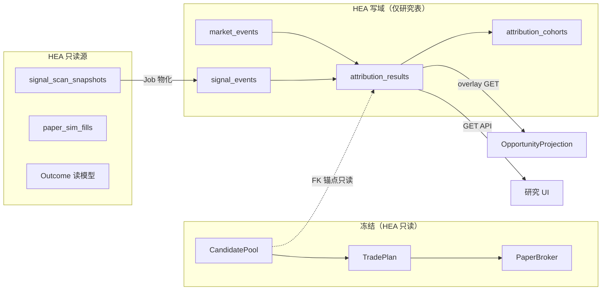

# Phase17-B HEA 实现边界设计

**文档类型**：实现边界（Implementation Boundary）  
**日期**：2026-09-02  
**性质**：**只设计，不编码**  
**上游**：[PHASE17_ALPHA_RESEARCH_ENGINE_DESIGN.md](PHASE17_ALPHA_RESEARCH_ENGINE_DESIGN.md)（ARE / HEA 预研）  
**目标**：在实现 HEA 前，划定 **表迁移、Job、API、Projection overlay** 的硬边界，确保 **CandidatePool · TradePlan · PaperBroker 零侵入**。

---

## 0. 执行摘要

| 维度 | 边界结论 |
|------|----------|
| **HEA 定位** | 只读研究层：**读历史 → 物化归因 → 展示解释** |
| **表迁移** | 新增 4 表（`signal_events` / `market_events` / `attribution_results` / `attribution_cohorts`）；**不 ALTER** 交易链核心表 |
| **Job** | 全部 **离线异步**；**禁止**挂入 `BuildCandidatePool` / `BuildTradePlan` / PaperBroker 同步路径 |
| **API** | MVP 主入口 **`GET /api/research/attribution`**；Projection 仅 **overlay 读** |
| **冻结** | `CandidatePool`、`TradePlan`、`PaperBroker` **代码与写语义不变** |
| **禁止写** | Score · Rank · TradePlan · Execution **一律不可被 HEA 修改** |



---

## 1. 设计原则（Implementation Contract）

### 1.1 HEA 允许

| # | 能力 | 说明 |
|---|------|------|
| A1 | **读取**历史 snapshot / pool / plan / fill / outcome / K 线 / 新闻缓存 | 只读 SELECT；可走现有 `data` 包 |
| A2 | **写入** 4 张研究表 | INSERT/UPSERT；幂等键见 §2 |
| A3 | **生成** `attribution_results` + `attribution_cohorts` | 离线 Job |
| A4 | **展示** AttributionBlock / 研究 Tab / cohort 报表 | 经 GET API + Projection overlay |
| A5 | **导出** cohort JSON（人工批准后供 enhancer 消费） | P1；MVP 仅文件/export 端点只读 |

### 1.2 HEA 禁止

| # | 禁止项 | 原因 |
|---|--------|------|
| F1 | 修改 `candidate_pool_items.score` / `rank` | Pool 为 Phase16 权威横截面 |
| F2 | 调用或触发 `BuildCandidatePool` / `BuildTradePlan` / 物化 / 批准 / 冻结 / 执行 | 研究 ≠ 交易 |
| F3 | 写入 `trade_plans` / `trade_plan_items` / `paper_sim_*` | Execution 链隔离 |
| F4 | 在实时交易链 **同步** 拉新闻/算归因 | 延迟与 SLA 不可控 |
| F5 | 阻塞 `GET /api/opportunities/projections` 默认路径 | overlay 可选、可降级 |
| F6 | 修改 Phase16 已有 Projection 字段 **语义** | Beta 契约 |
| F7 | MVP 自动反哺改分 | 过拟合；见 Phase17 §8.4 安全阀 |

### 1.3 冻结组件契约

| 组件 | HEA 关系 | 允许改动 |
|------|----------|:--------:|
| **CandidatePool** | 只读 `pool_id` / `pool_item_id` / `signal_snapshot_id` / `signal_tag` / score / rank **作锚点与 cohort 分组** | ❌ 无 |
| **TradePlan** | 只读 `plan_id` / item 状态 **作 Outcome 交叉引用（P2）** | ❌ 无 |
| **PaperBroker** | 只读 `paper_sim_fills` **作 ex-post 统计** | ❌ 无 |
| **OpportunityProjection** | 新增 **可选** `attribution` overlay 字段 | ✅ 仅 **追加** JSON 字段 |
| **OutcomeProjection** | P2 可选 `attribution_validation` overlay | ✅ 仅追加（MVP 不做） |

---

## 2. 数据表迁移范围

> **迁移版本建议**：`schema v11`（研究域独立）；迁移脚本 **仅 CREATE + INDEX**；**无** 对 `candidate_pools` / `trade_plans` / `paper_sim_*` 的 ALTER。

### 2.1 总览

| 表 | MVP | 写入者 | 读取者 | 与交易链 FK |
|----|:---:|:------:|:------:|:-----------:|
| `signal_events` | ✅ | Job-S1 | Job-A1, API, overlay | → `signal_scan_snapshots`（只读父表） |
| `market_events` | ✅ | Job-M1 | Job-A1 | 无交易 FK |
| `attribution_results` | ✅ | Job-A1 | API, overlay, Job-C1 | → pool_item / snapshot（nullable，无 CASCADE DELETE 到交易表） |
| `attribution_cohorts` | ✅ | Job-C1 | API, overlay | 无交易 FK |

**明确不在 MVP 迁移内**（P1+）：`outcome_round_trips`、`sector_daily_stats`、`capital_flow_daily`、`attribution_feedback_runs`。

---

### 2.2 `signal_events` — Signal Hit 行表化

**目的**：将 `signal_scan_snapshots.result_json` 投影为可 SQL cohort 的行表；**不修改** snapshot 本体。

| 项 | 规格 |
|----|------|
| **迁移操作** | `CREATE TABLE signal_events (...)` + 唯一索引 + 查询索引 |
| **数据来源** | 只读 `signal_scan_snapshots` WHERE `status='done'` |
| **写入时机** | Job-S1 **异步**（snapshot 完成后）；可回填历史 snapshot |
| **幂等键** | `(snapshot_id, stock_code)` → UPSERT |
| **禁止** | UPDATE/DELETE snapshot；在 snapshot 写入路径内同步物化 |

**列（MVP 最小集）**：

| 列 | 类型 | 约束 | 说明 |
|----|------|------|------|
| `id` | INTEGER PK | AUTO | |
| `snapshot_id` | INTEGER | NOT NULL, FK 逻辑引用 | → `signal_scan_snapshots.id` |
| `trade_date` | TEXT | NOT NULL | 冗余索引 |
| `session` | TEXT | | close / morning 等 |
| `stock_code` | TEXT | NOT NULL | 内部小写规范 |
| `stock_name` | TEXT | | |
| `signal_tag` | TEXT | | hit.tag |
| `signal_price` | REAL | | |
| `signal_time` | TEXT | | ISO 或交易日时间 |
| `industry` | TEXT | | hit.INDUSTRY |
| `concept` | TEXT | | hit.CONCEPT |
| `change_rate` | REAL | | 扫描日涨跌幅 |
| `volume_ratio` | REAL | | |
| `rsi` | REAL | | |
| `schema_version` | TEXT | NOT NULL | 如 `signal_event.v1` |
| `created_at` | DATETIME | NOT NULL | 物化时刻 |

**索引**：

- `UNIQUE (snapshot_id, stock_code)`
- `INDEX (trade_date, stock_code)`
- `INDEX (signal_tag, trade_date)` — cohort 用

**回填策略**：按 `snapshot_id` 分批；失败单行 **skip + log**，不 rollback 交易库。

---

### 2.3 `market_events` — 统一事件流

**目的**：新闻 / 公告 / 板块异动 / 指数 / 资金流 spike 的统一物化；供归因引擎取窗口内证据。

| 项 | 规格 |
|----|------|
| **迁移操作** | `CREATE TABLE market_events (...)` |
| **数据来源** | 外部 API（`MarketNewsApi` 等）+ 内部衍生（板块 proxy） |
| **写入时机** | Job-M1 **T+1 批量** 或 cron 日更；**非** 用户请求时实时抓取 |
| **幂等键** | `(source, source_id)` → UPSERT |
| **禁止** | 作为 TradePlan 触发源；无 SLA 爬虫作为唯一证据 |

**列（MVP 最小集）**：

| 列 | 类型 | 说明 |
|----|------|------|
| `id` | INTEGER PK | |
| `event_type` | TEXT | `news` / `announcement` / `sector_move` / `index_move` / `flow_spike` |
| `stock_code` | TEXT NULL | 个股事件必填 |
| `sector_code` | TEXT NULL | 板块/行业 |
| `event_time` | DATETIME | **发布时间**（非入库时间） |
| `trade_date` | TEXT | 对齐交易日 |
| `title` | TEXT | |
| `summary` | TEXT NULL | |
| `source` | TEXT | 如 `cls` / `internal_scan` |
| `source_id` | TEXT | 去重 |
| `payload_json` | TEXT | 原始字段 |
| `sentiment_score` | REAL NULL | -1..1 |
| `schema_version` | TEXT | `market_event.v1` |
| `created_at` | DATETIME | |

**索引**：`UNIQUE (source, source_id)`；`INDEX (stock_code, trade_date)`；`INDEX (trade_date, event_type)`。

---

### 2.4 `attribution_results` — 归因核心产物

**目的**：对 `(stock_code, trade_date, 锚点)` 输出五类归因标签 + 证据；**HEA 主写表**。

| 项 | 规格 |
|----|------|
| **迁移操作** | `CREATE TABLE attribution_results (...)` |
| **数据来源** | Job-A1 规则引擎读 anchors + events + bars |
| **写入时机** | Pool 物化后 **异步**；可 nightly 重算 |
| **幂等键** | `(stock_code, trade_date, pool_item_id, engine_version)` — `pool_item_id` NULL 时用 `(stock_code, trade_date, signal_event_id, engine_version)` |
| **禁止** | 回写 pool / plan / fill；CASCADE 删除交易表 |

**列（MVP 最小集）**：

| 列 | 类型 | 说明 |
|----|------|------|
| `id` | INTEGER PK | |
| `stock_code` | TEXT NOT NULL | |
| `trade_date` | TEXT NOT NULL | 研究主键（发现日） |
| `pool_id` | INTEGER NULL | 只读锚点 |
| `pool_item_id` | INTEGER NULL | **CandidatePool 主锚** |
| `snapshot_id` | INTEGER NULL | |
| `signal_event_id` | INTEGER NULL | → `signal_events.id` |
| `opportunity_id` | TEXT NULL | 与 Projection 对齐 |
| `primary_category` | TEXT NOT NULL | 五类 enum |
| `categories_json` | TEXT NOT NULL | 多标签 JSON 数组 |
| `rise_pct` | REAL NULL | 窗口涨幅 |
| `confidence` | REAL NOT NULL | 0..1 |
| `evidence_json` | TEXT NOT NULL | AttributionItem[] |
| `engine_version` | TEXT NOT NULL | 如 `hea_rules.v1` |
| `quality` | TEXT NOT NULL | complete / partial / missing |
| `computed_at` | DATETIME NOT NULL | |

**索引**：

- `UNIQUE (stock_code, trade_date, pool_item_id, engine_version)` WHERE pool_item_id IS NOT NULL
- `INDEX (pool_item_id)`
- `INDEX (signal_event_id)`
- `INDEX (primary_category, trade_date)`

**锚点优先级**（与 Phase17 §6.1 一致）：

1. `pool_item_id` 存在 → 完整归因 + cohort_hint  
2. 仅 `signal_event_id` → `quality=partial`  
3. 均无 → **不写入**（API 404 / overlay `present=false`）

---

### 2.5 `attribution_cohorts` — 预聚合统计

**目的**：回答「某 signal_tag / 归因类 / sector 历史上 T+N 表现如何」；供 overlay `cohort_hint` 与 research UI。

| 项 | 规格 |
|----|------|
| **迁移操作** | `CREATE TABLE attribution_cohorts (...)` |
| **数据来源** | Job-C1 聚合 `signal_events` + forward return（Outcome 读算或 P1 物化表） |
| **写入时机** | nightly / attribution batch 完成后 |
| **幂等键** | `(cohort_key, horizon, engine_version)` → UPSERT |
| **禁止** | 直接驱动 Score/Rank 变更 |

**列（MVP 最小集）**：

| 列 | 类型 | 说明 |
|----|------|------|
| `id` | INTEGER PK | |
| `cohort_key` | TEXT NOT NULL | `tag:强` / `cat:TECH_BREAKOUT` / `sector:半导体` |
| `horizon` | TEXT NOT NULL | `T1` / `T5` / `T20` |
| `sample_size` | INTEGER NOT NULL | |
| `win_rate` | REAL NULL | n&lt;30 时为 NULL |
| `avg_return` | REAL NULL | |
| `median_return` | REAL NULL | |
| `engine_version` | TEXT NOT NULL | |
| `computed_at` | DATETIME NOT NULL | |

**索引**：`UNIQUE (cohort_key, horizon, engine_version)`。

**MVP cohort 范围**：仅 `tag:{signal_tag}` × `T5`；其余 P1 扩展。

---

### 2.6 迁移执行边界

| 规则 | 说明 |
|------|------|
| **单事务** | 每表独立 migration；失败可重跑 |
| **回滚** | 仅 `DROP TABLE` 研究表；**不** touch 交易表 |
| **EnsureSchema** | 新增 `backend/research/schema.go`（实现时）；**不** 并入 `papertrading.EnsureSchema` |
| **healthcheck** | 扩展只读检查：4 表存在 + 样本行可读；**不** 阻断交易链启动 |
| **现有 DB** | 生产 `stock.db` 在线迁移：CREATE IF NOT EXISTS；无锁表 ALTER |

---

## 3. Job 边界

### 3.1 原则

| 原则 | 说明 |
|------|------|
| **离线 only** | 全部 Job 为 cron / 手动 CLI / 队列消费者；**无** HTTP 请求内同步执行 |
| **单向依赖** | 研究 Job 可读交易表；交易 Job **不得** 读/写研究表 |
| **失败隔离** | Job 失败 **不** 影响 Pool/Plan/Broker 状态机 |
| **幂等** | 所有写研究表 Job 必须可重复跑 |

### 3.2 MVP Job 清单（HEA 域内）

| Job ID | 名称 | 触发 | 输入（只读） | 输出（写） | 频率 |
|--------|------|------|--------------|------------|------|
| **Job-S1** | MaterializeSignalEvents | snapshot `done` 事件 / nightly | `signal_scan_snapshots` | `signal_events` | 日更 + 回填 |
| **Job-M1** | IngestMarketEvents | cron T+1 02:00 | 新闻/指数 API | `market_events` | 日更 |
| **Job-A1** | ComputeAttribution | S1 后 / pool 日更后 | `signal_events`, `market_events`, `candidate_pool_items`, K线 | `attribution_results` | 日更 |
| **Job-C1** | AggregateCohorts | A1 后 | `signal_events`, `attribution_results`, Outcome 读算 | `attribution_cohorts` | 日更 |

**Job 编排（推荐）**：

```text
[交易链 - 不变]
  SignalScan → BuildCandidatePool → (用户) BuildTradePlan → PaperBroker

[研究链 - 并行]
  Job-S1 ──→ Job-A1 ──→ Job-C1
  Job-M1 ──↗
```

### 3.3 离线研究 Job 详细边界

#### Job-S1：MaterializeSignalEvents

| 允许 | 禁止 |
|------|------|
| SELECT snapshot + 解析 JSON hits | 在 `BuildCandidatePool` 内调用 |
| INSERT/UPSERT `signal_events` | UPDATE `signal_scan_snapshots` |
| 按 snapshot 分批、可断点续跑 | 阻塞 scan 完成回调 |

#### Job-M1：IngestMarketEvents

| 允许 | 禁止 |
|------|------|
| 调用 `MarketNewsApi` 等批量拉取 | 用户打开 Drawer 时实时拉全量新闻 |
| UPSERT `market_events` | 写入 `candidate_pool_items` |
| T+1 对齐 `trade_date` | 作为自动买卖触发 |

#### Job-A1：ComputeAttribution

| 允许 | 禁止 |
|------|------|
| SELECT pool items 作锚点列表 | 修改 score/rank |
| SELECT K 线 / index / sector proxy | 调用 `BuildTradePlan` |
| 规则打分 → UPSERT `attribution_results` | 写入 plan / fill |
| `engine_version`  bump 全量重算 | 同步于 projection HTTP handler |

**MVP 规则必达**：`TECH_BREAKOUT` + `SECTOR_LINKAGE`；其余三类尽力。

#### Job-C1：AggregateCohorts

| 允许 | 禁止 |
|------|------|
| 按 `signal_tag` 聚合 forward return | 输出直接改 `ComposeCandidateScore` |
| n&lt;30 时 `win_rate=NULL` | 阻塞 A1 |
| UPSERT `attribution_cohorts` | 写 `config_json` 自动校准（P1 人工批准） |

### 3.4 实时交易链 — 明确禁止挂载点

以下路径 **不得** import / 调用 HEA 包或同步查 `attribution_results`：

| 路径 | 组件 | 原因 |
|------|------|------|
| Pool 构建 | `BuildCandidatePool` / `ComposeCandidateScore` / `FilterPoolForTradePlan` | Score/Rank 权威 |
| Plan 构建 | `BuildTradePlan` / draft / materialize / approve / freeze | 执行语义 |
| 成交 | `PaperBroker` / `paper_sim_fills` INSERT | 成交事实 |
| 计划读iness | `tradingplan/readiness` | 实时 gate |
| Cron 交易 | `MaterializeMorning*` / 自动成交 | 低延迟路径 |
| Wails 调试 | `debugBuildCandidatePool` 等 TEMP | 已有 TEMP 边界 |

**允许的唯一「近实时」行为**：用户显式 `GET /api/research/attribution` 或 `include_attribution=1` 时，**只读**已物化行；未命中则 404 / `present=false`，**不** 触发 Job。

### 3.5 Job 运行方式（实现时）

| 方式 | MVP | 说明 |
|------|:---:|------|
| CLI `go run ./cmd/hea-job ...` | ✅ | 开发/回填 |
| 内置 cron（app 启动注册） | ✅ | 日更 |
| 外部 scheduler | P1 | 生产可选 |
| HTTP POST 触发 Job | ❌ | 避免误触生产 |

---

## 4. API 边界

### 4.1 MVP 主端点：`GET /api/research/attribution`

**职责**：返回 **已物化** 的单票/单锚点归因；**不** 现场算规则、**不** 写库。

#### 请求

| 参数 | 必填 | 说明 |
|------|:----:|------|
| `stock_code` | ✅ | 内部小写 |
| `trade_date` | | 默认最近有结果日 |
| `pool_item_id` | | 精确锚点；优先于 trade_date |
| `engine_version` | | 默认当前 active |

#### 响应（200）

```json
{
  "ok": true,
  "code": 0,
  "attribution": {
    "present": true,
    "stock_code": "sz301125",
    "trade_date": "2026-09-01",
    "pool_item_id": 42,
    "primary_category": "TECH_BREAKOUT",
    "categories": ["TECH_BREAKOUT", "SECTOR_LINKAGE"],
    "rise_pct": 0.052,
    "confidence": 0.72,
    "items": [ { "category": "TECH_BREAKOUT", "role": "primary", "summary": "...", "evidence": [] } ],
    "cohort_hint": { "signal_tag": "强", "tag_win_rate_t5": 0.58, "sample_size": 42 },
    "quality": "partial",
    "engine_version": "hea_rules.v1",
    "computed_at": "2026-09-02T02:00:00+08:00",
    "disclaimer": "归因基于可观测因子共现，非投资建议。"
  }
}
```

#### 错误语义

| HTTP | 条件 |
|------|------|
| 200 + `present:false` | 无物化结果（合法空态） |
| 400 | 缺 `stock_code` |
| 404 | 明确 `pool_item_id` 不存在 |
| 500 | DB 异常（**不** 触发重算 Job） |

#### API 硬边界

| 允许 | 禁止 |
|------|------|
| SELECT `attribution_results` + JOIN `attribution_cohorts` | POST/PUT/PATCH/DELETE |
| 只读 JOIN `candidate_pool_items`（展示 rank/score **原值**） | 返回「建议买入」类文案 |
| 注册于 `RegisterResearchRoutes` 新 mux 组 | 并入 `RegisterTradePlansRoutes` |
| GET-only middleware | 在 handler 内调用 Job-A1 |

---

### 4.2 相关 API（边界分级）

| 端点 | MVP | 与主端点关系 | 边界 |
|------|:---:|--------------|------|
| **`GET /api/research/attribution`** | ✅ | **主入口** | §4.1 |
| `GET /api/opportunities/projections?include_attribution=1` | ✅ | overlay 聚合 | §5；默认 **不含** attribution |
| `GET /api/research/cohorts?key=&horizon=` | P1 | cohort 直查 | 只读 `attribution_cohorts` |
| `GET /api/research/events?stock_code&from&to` | P1 | 事件时间线 | 只读 `market_events` |
| `POST /api/research/recompute` | ❌ | — | MVP 不做（防生产误触） |

---

### 4.3 与冻结 API 的隔离

| 现有 API | HEA 影响 |
|----------|----------|
| `GET /api/opportunities/projections` | 仅 **可选** 追加 `attribution` 字段；默认响应 **字节级兼容**（不含新字段） |
| `GET /api/tradeplans/*` | **无** 变更 |
| `POST` 计划/成交相关 | **无** 变更 |
| `GET /api/portfolio/*` | **无** 变更（P2 可选 provenance 只读链接） |

---

## 5. Projection Overlay 设计

### 5.1 设计目标

在 **不修改** Phase16 五层（Signal / Opportunity / Decision / TradePlan / Portfolio）语义的前提下，追加 **第六层 overlay**：`AttributionBlock`，模式与现有 `ResearchBlock` 一致。

### 5.2 类型扩展（实现时）

```go
// OpportunityProjection — 仅追加字段
Attribution *AttributionBlock `json:"attribution,omitempty"`
```

**与 `ResearchBlock` 分工**：

| 块 | 回答 | 数据来源 |
|----|------|----------|
| `research`（已有） | 研究候选 / signal score 摘要 | `research.Candidate` |
| `attribution`（新增） | **为什么涨**（五类 HEA） | `attribution_results` + `attribution_cohorts` |

两者 **互不覆盖**；均 **不得** 写入 `OpportunityBlock.score` / `rank`。

### 5.3 AttributionBlock JSON 契约

```json
{
  "attribution": {
    "present": true,
    "as_of": "2026-09-02T10:00:00+08:00",
    "primary_category": "TECH_BREAKOUT",
    "categories": ["TECH_BREAKOUT", "SECTOR_LINKAGE"],
    "rise_pct": 0.052,
    "window": { "trade_date": "2026-08-28", "horizon": "T0" },
    "items": [
      {
        "category": "TECH_BREAKOUT",
        "role": "primary",
        "confidence": 0.72,
        "summary": "收盘扫描命中「强」标签，量比>2",
        "evidence": [
          { "type": "signal_tag", "ref": "强", "signal_event_id": 1001 },
          { "type": "volume_ratio", "value": 2.3, "threshold": 1.5 }
        ]
      }
    ],
    "cohort_hint": {
      "signal_tag": "强",
      "tag_win_rate_t5": 0.58,
      "sample_size": 42
    },
    "quality": "partial",
    "engine_version": "hea_rules.v1",
    "disclaimer": "归因基于可观测因子共现，非投资建议。"
  }
}
```

**空态**（未物化 / 无锚点）：

```json
{
  "attribution": {
    "present": false,
    "quality": "missing",
    "disclaimer": "归因基于可观测因子共现，非投资建议。"
  }
}
```

### 5.4 Overlay 加载边界

| 项 | 规格 |
|----|------|
| **触发** | Query `include_attribution=1` **或** Drawer「涨因」Tab Dedicated fetch |
| **加载路径** | `projection.Service` → `attribution.Loader`（只读 repo） |
| **超时** | ≤50ms 读 DB；**无** 则跳过，不拖慢默认 projection |
| **缓存** | 可选内存 TTL；**禁止** 写穿到 Pool |
| **metadata.missing** | 无归因时追加 `"attribution"`；**不** 降级 quality 为 fail |

### 5.5 前端展示边界（MVP）

| 位置 | 行为 |
|------|------|
| `OpportunityProjectionDrawer` | 新 Tab **「涨因」**；只读 + disclaimer |
| `ResearchCandidatePool` / `#/stock-screen` | **不** 改 score/rank 列 |
| 机会列表决策列 | **不** 用 attribution 替换 decision badge |
| Outcome Tab | MVP **不** 改；P2 只读验证块 |

### 5.6 Overlay 禁止项

| 禁止 | 说明 |
|------|------|
| 用 `primary_category` 改 decision Tag 颜色 | 决策 ≠ 涨因 |
| attribution 缺失 → 隐藏 Opportunity 层 | 五层独立 |
| 在 overlay loader 内调用 `ProjectOne` 递归 | 避免环 |
| 将 cohort `win_rate` 渲染为「预测收益」 | 合规 |

---

## 6. 读路径 vs 写路径对照

```text
┌─────────────────────────────────────────────────────────────────┐
│                        用户 / UI                                 │
├─────────────────────────────────────────────────────────────────┤
│  GET /api/research/attribution          GET .../projections     │
│       ?stock_code&trade_date                 ?include_attribution=1
│              │                                      │
│              └──────────────┬───────────────────────┘
│                             ▼
│                   attribution.Loader (SELECT only)
│                             │
│              attribution_results / attribution_cohorts
└─────────────────────────────────────────────────────────────────┘

┌─────────────────────────────────────────────────────────────────┐
│                     离线 Job（无 HTTP）                          │
├─────────────────────────────────────────────────────────────────┤
│  Job-S1 → signal_events                                         │
│  Job-M1 → market_events                                         │
│  Job-A1 → attribution_results    ← 读 pool_items (SELECT only)  │
│  Job-C1 → attribution_cohorts                                   │
└─────────────────────────────────────────────────────────────────┘

┌─────────────────────────────────────────────────────────────────┐
│                   冻结写路径（HEA 不得 import）                   │
├─────────────────────────────────────────────────────────────────┤
│  BuildCandidatePool → candidate_pool_items (score, rank)        │
│  BuildTradePlan     → trade_plans / items                       │
│  PaperBroker        → paper_sim_fills / positions               │
└─────────────────────────────────────────────────────────────────┘
```

---

## 7. MVP 实现清单与验收边界

### 7.1 In Scope（Phase17-B MVP）

| ID | 交付 | 验收 |
|----|------|------|
| B1 | schema v11 四表 migration | healthcheck 可读 |
| B2 | Job-S1 / Job-M1 / Job-A1 / Job-C1 CLI | 幂等重跑不 duplicate |
| B3 | `GET /api/research/attribution` | 200 + 物化样本 |
| B4 | `include_attribution=1` overlay | 默认响应不变 |
| B5 | Drawer「涨因」Tab（只读） | disclaimer 存在 |
| B6 | Beta v0.4 smoke **零回归** | 同 Phase17 §9.4 V5 |

### 7.2 Out of Scope（本边界文档排除）

| 排除项 | 阶段 |
|--------|------|
| DTO/display 重构 | — |
| 自动 weight 反哺 `ComposeCandidateScore` | P1+ |
| `outcome_round_trips` 物化 | P1 |
| `POST /api/research/recompute` | P1 |
| LLM 分类 | P2 |
| 修改 CandidatePool / TradePlan / PaperBroker 任何写逻辑 | **永不** |

### 7.3 验收硬指标（与 Phase17 对齐）

| # | 检查 |
|---|------|
| V1 | Pool 中任一 `pool_item_id` 可查到 ≥1 条 `attribution_results` |
| V2 | `TECH_BREAKOUT` 必须引用 `signal_event_id` 证据 |
| V3 | cohort `tag:强` 返回 `sample_size` + `win_rate`（允许 NULL if n&lt;30） |
| V4 | 归因前后 `candidate_pool_items.score/rank` **字节不变** |
| V5 | Execution smoke（Beta v0.4）零回归 |
| V6 | `GET /api/research/attribution` **无** POST；Job **无** HTTP 入口 |

---

## 8. 包结构与文件边界（实现时参考，本次不创建）

```text
backend/research/
  schema.go              # EnsureResearchSchema — 四表 ONLY
  signal_events/         # Job-S1 repo + materializer
  market_events/         # Job-M1 ingest
  attribution/           # Job-A1 engine + Loader (read)
  cohort/                # Job-C1 aggregator
backend/api/
  research_attribution.go   # GET /api/research/attribution ONLY (MVP)
backend/opportunity/projection/
  attribution_block.go      # AttributionBlock type + overlay attach
cmd/
  hea-job/                    # CLI entry for S1/M1/A1/C1
```

**禁止路径**：

- `backend/strategy/*` 内 HEA import  
- `backend/papertrading/*` 写路径 HEA import  
- `frontend/src/api/tradePlan*.ts` 增加 attribution 写方法  

---

## 9. 风险与缓解

| 风险 | 缓解 |
|------|------|
| 开发者误在 Pool 构建后同步调 A1 | Code review + lint 禁止 import；文档 §3.4 |
| overlay 拖慢 projection P99 | 默认关闭；50ms 超时降级 |
| 研究表 migration 失败阻断 app 启动 | EnsureResearchSchema 错误 **log warn**；交易链照常（MVP 可配置 strict P1） |
| attribution 与 Explanation 用户混淆 | 独立 Tab + 不同 disclaimer |
| cohort 小样本误导 | n&lt;30 不输出 point estimate |

---

## 10. 结论

**PHASE17-B** 将 HEA 严格限定为：

1. **四表迁移** — 研究域独立 schema，FK 只读锚定 Pool/Snapshot，**无 CASCADE 写交易链**  
2. **四 Job 离线** — S1/M1/A1/C1 全部异步，**实时交易链零挂载**  
3. **单主 API** — `GET /api/research/attribution` 只读物化结果  
4. **Projection overlay** — 可选 `attribution` 块，**五层语义不变**  
5. **冻结** — CandidatePool · TradePlan · PaperBroker **完全不变**；Score · Rank · Execution **HEA 不可碰**

**下一步（实现 Phase17-B MVP 前）**：评审本边界 → 确认 schema v11 DDL → 编写 Job CLI 规格 → 开实现分支。

---

**交付物**：`PHASE17_B_HEA_IMPLEMENTATION_BOUNDARY.md`  
**本阶段**：只设计，**未编写任何 Go/Vue/SQL 代码**。
