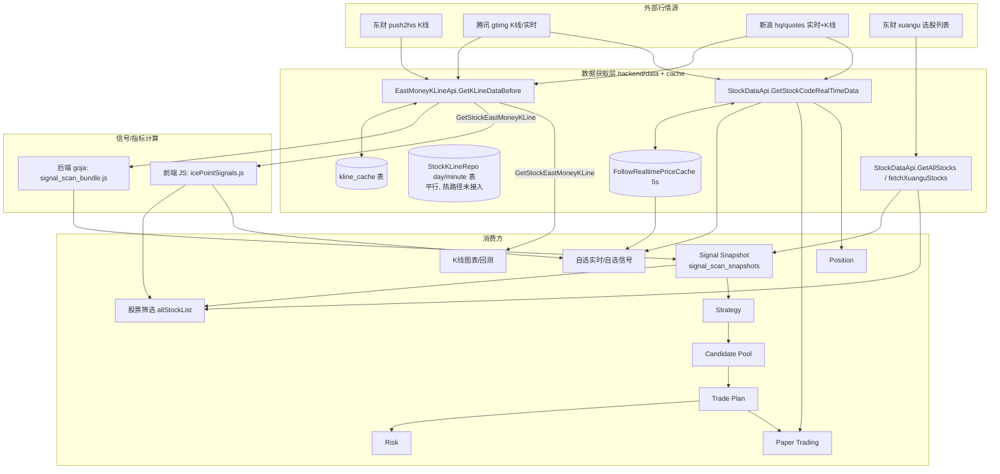

# Phase6.7-H 行情数据层审计报告（只读分析）

> 本文档为**只读审计**，不修改任何代码 / 数据库 / 行情 API / 策略 / Trade Plan / Paper Trading。
> 目的：梳理现有行情数据层结构，为后续「行情智能层（Market Intelligence Layer）」设计做准备。仅输出分析与设计，不含实现。
>
> 代码证据均引用 `D:\stock` 主源码树；`build\*_wt\`、`build\artifact_*`、`build\commit_*` 等目录为历史 worktree 快照，本审计一律忽略。

---

## 1. 行情数据入口地图（Module → Data source → Call sites）

按四类能力划分：K 线获取、实时行情、股票基础/名单、指标/信号计算。

### 1.1 K 线获取（K-line fetch）

| 模块 / 函数 | 数据源 | 缓存 | 主要调用方（Call sites） |
|---|---|---|---|
| `EastMoneyKLineApi.GetKLineDataBefore` / `GetKLineData`（`backend/data/eastmoney_kline_api.go:684 / 673`） | 东财 push2his `push2his.eastmoney.com/api/qt/stock/kline/get`，无数据时依次回退：腾讯 `web.ifzq.gtimg.cn`（`fetchTencentKLineFallback:181`）→ 新浪日 K（`fetchSinaKLineFallback:276`）→ 新浪分钟 K（`fetchSinaMinuteKLineFallback:343`） | `kline_cache` 表（`backend/data/kline_cache.go`）：日/周/月 latest TTL 60s、历史 24h；分钟 latest 30s；支持增量合并（`supportsIncrementalLatestKLine` + `mergeKLineDataByDay`） | 1) `App.GetStockEastMoneyKLine` / `GetStockEastMoneyKLinePage`（`app.go:1852 / 1857`）→ 前端所有 K 线消费；2) `SignalScanApi.prepareStockBars`（`signal_scan_api.go:163`）与 `buildIndexCloseMap`（:137）；3) `StockDataApi.LookupFollowBaselinePrice`（`stock_data_api.go:614`）；4) Agent 工具 `tool_kline.go` / `tool_eastmoney_kline.go` / `stock_k_line_data_tool.go`、`openai_stream.go`；5) `scripts/scansignals/main.go:54` |
| `EastMoneyKLineApi.GetKLineWithMA`（`eastmoney_kline_api.go:1067`） | 同上（内部调 `GetKLineData`）+ 本地 SMA 计算（`computeSMA:1115`） | 依赖底层 kline_cache | K 线带均线的图表/工具场景 |
| `StockDataApi.GetCommonKLineData`（`stock_data_api.go:2004`） | 腾讯 `web.ifzq.gtimg.cn/appstock/app/fqkline`（qfq） | 无 | 1) 东财 K 线的腾讯回退路径（`eastmoney_kline_api.go:204`）；2) `App.GetStockCommonKLine`（`app.go:1846`）；3) `App.GetStockKLine`（HK，:1832，实为 `GetHK_KLineData`） |
| `StockKLineRepo`（`backend/data/stock_kline_repo.go`） | 不主动抓网；`UpsertBars` / `QueryBars` 读写规范化 `stock_kline_day` / `stock_kline_minute` 表 + `stock_kline_sync_state` 水位 | 自身即持久层 | 正式 K 线仓储层，**与 `kline_cache` 平行存在**；当前热路径未接入（详见 §3.4） |

前端 K 线入口统一走 `GetStockEastMoneyKLine`（Wails 绑定）：
- `frontend/src/utils/indexKlineCache.js`：指数日 K 共享单例（TTL 60s + in-flight 去重）。
- `frontend/src/utils/watchlistSignalScan.js:134`：`fetchDailyBars` 逐票拉取（JS 侧再套一层 `dailyBarsCache`，5min TTL、上限 8000）。
- `frontend/src/components/allStockList.vue:504`、`StockLightweightKlineChart.vue`、`SignalBacktestPanel.vue`、`HoldingTPanel.vue` 等图表/回测组件。

### 1.2 实时行情（Realtime price / quote）

| 模块 / 函数 | 数据源 | 缓存 | 主要调用方 |
|---|---|---|---|
| `StockDataApi.GetStockCodeRealTimeData`（`stock_data_api.go:386`） | 腾讯 `qt.gtimg.cn`（A 股/港股）+ 新浪 `hq.sinajs.cn`（美股等）；>阈值自动分片（`getStockCodeRealTimeDataChunked:415`）；抓到后异步 upsert `StockInfo` 到 DB | **无内建缓存**（缓存在上层，见下） | 1) `GetStockInfosRealtimeBatch`（`app.go:1169`）→ `GetFollowRealtimeList`（:1380）；2) `MonitorStockPrices`（`app_windows.go:92` / `app_linux.go:262` / `app_darwin.go:92`）；3) papertrading `RealtimeOpenPriceProvider.OpenQuote` 与 `.MarkPrice`（`backend/papertrading/realtime_price.go:38 / 65`）；4) `paper_open_buy.go:203` 默认行情源；5) `ai_recommend_stocks_api.go:121`；6) `StockDataApi.Follow`（:557）、`getStockInfo`（`app.go:1216`） |
| `cache.FollowRealtimePriceCache`（`backend/cache/stock_price_cache.go:37`） | 进程内 map，TTL 默认 5s（可 `GOSTOCK_PRICE_CACHE_TTL_SEC` 覆盖）；`Partition` 命中/未命中拆分 | 自身即缓存 | **仅** `GetStockInfosRealtimeBatch`（自选实时列表）使用；papertrading / paper_open_buy / ai_recommend **未接该缓存** |

### 1.3 股票基础信息 / 名单（Stock basic info）

| 模块 / 函数 | 数据源 | 调用方 |
|---|---|---|
| `StockDataApi.GetAllStocks` → `fetchXuanguStocks`（`stock_data_api.go:2813 / 2632`） | 东财选股 `data.eastmoney.com/dataapi/xuangu/list`（含 NEW_PRICE/CHANGE_RATE/行业/概念等快照字段）；板块走 `getAllStocksByPlateCode` | 1) `App.GetAllStocks` → 前端 `allStockList.vue:916/1289/1481`（股票筛选）；2) `SignalScanApi.fetchAllMarketStocks`（`signal_scan_api.go:115`，全市场约 5400 只分页拉取）；3) `stock_strategy_api.go:282` |
| `StockDataApi.GetStockList`（`stock_data_api.go:857`）、`stock_basic_unified.go`、`GetStockBaseInfo`（:334） | 本地 DB / 东财基础信息 | `App.GetStockList`（`app.go:1389`）、代码补全/名称回填 |

### 1.4 指标 / 信号计算（Indicator & signal）

| 运行时 | 引擎 | 源文件 | 调用方 |
|---|---|---|---|
| 后端 Go（goja） | `RunSignalScanBatchJS`（`backend/data/signal_scan_runner.go:53`）执行内嵌 `signal_scan_bundle.js` | `backend/data/signal_scan_bundle.js`（由 `scripts/scansignals/scan-batch.ts` 打包，**import 前端 `frontend/src/utils/*.js` 信号源**） | `RunFullMarketSnapshot`（`signal_scan_api.go:294`）全市场快照 |
| 前端浏览器 JS | `summarizeBuySignal` 等 | `frontend/src/utils/icePointSignals.js`（及 `addPositionSignals.js` / `rushReduceSignals.js` / `costAwareSellSignals.js` / `holdingPositionAdjust.js` / `sellPositionRatio.js` …） | `watchlistSignalScan.js`（`scanRowsLastBarSignals` / `scanWatchlistSignals`）、`stock.vue`、`StockLightweightKlineChart.vue` |
| 两侧共用 | 指数 MA20 | 后端 `buildIndexCloseMap` + JS `buildIndexMa20ByDay`；前端 `ensureIndexMa20ByDay`（`watchlistSignalScan.js:66`） | 信号计算的大盘上下文 |
| 后端 | SMA 均线 | `GetKLineWithMA` / `computeSMA`（`eastmoney_kline_api.go:1067/1115`） | 图表/工具 |

---

## 2. 数据消费链（Data-flow）

**链路说明**

1. **股票筛选（allStockList）**：`GetAllStocks`（xuangu 快照）+ 两种信号来源二选一——已选快照时读 `GetLatestSignalScanSnapshotMetaByStrategy`（复用 Signal Snapshot，Phase6.7-G 成果）；否则前端 `scanRowsLastBarSignals` 逐票 `GetStockEastMoneyKLine` 现算（`allStockList.vue:1307/1339`）。
2. **Signal Snapshot**：`RunFullMarketSnapshot`（异步 `StartFullMarketSnapshotAsync`）= `fetchAllMarketStocks`（xuangu 名单，约 5400）+ 并发 32 逐票 `GetKLineData`（120 根日 K）+ goja 批量信号 → 落 `signal_scan_snapshots` 表。Phase6.7-F 实测全量 20–40 分钟。
3. **Strategy → Candidate Pool → Trade Plan**：策略/候选池/计划以**快照与 DB 记录**为输入，`tradeplan_candidate.go` 未直接抓 K 线或实时行情（无 `GetKLineData`/`GetStockCodeRealTimeData` 调用）；`morning_price_materialize.go` 通过注入的 `MorningOpenPriceFunc` 取开盘参考价，行情来源由上层装配。
4. **Trade Plan → Paper Trading**：下单价量取自 Frozen Spec（`limit_price` / `target_volume`，`paper_open_buy.go:451`）；实时行情仅作**观测性名称补全**（`fetchOpenBuyQuotes`，:423）。
5. **Risk / Position / Paper Trading 结算**：`papertrading` 通过 `PriceProvider.OpenQuote`（成交价）与 `MarkPricer.MarkPrice`（盯市，`settlement.go:83`）取价，底层均为 `GetStockCodeRealTimeData`。
6. **自选实时**：`MonitorStockPrices`（cron）+ `GetFollowRealtimeList` → `GetStockInfosRealtimeBatch`（走 `FollowRealtimePriceCache`）。

---

## 3. 重复计算与重复抓取（含证据）

### 3.1 日 K 线重复抓取（跨三条信号路径）

同一只股票的日 K 可能被以下互相独立的路径分别拉取：

- **(A) 全市场快照**：`prepareStockBars` → `GetKLineData(code,"101","",120)`（`signal_scan_api.go:163`），×约 5400 只。
- **(B) 前端筛选/自选现算**：`fetchDailyBars` → `GetStockEastMoneyKLine`（`watchlistSignalScan.js:134`）→ 后端同一个 `GetKLineDataBefore`。
- **(C) 图表/回测查看**：`allStockList.vue:504`、`StockLightweightKlineChart.vue` 等再次 `GetStockEastMoneyKLine`。

三者最终都落到 `EastMoneyKLineApi.GetKLineDataBefore` + `kline_cache`。但：
- `kline_cache` 对「latest 日 K」TTL 仅 **60s**（`kline_cache.go:58`），前端 JS 侧 `dailyBarsCache` 为 **5min**、`indexKlineCache` 为 **60s**——**多层缓存 TTL 不一致**，60s 后重复扫描仍会击穿到网络。
- (A) 与 (B)/(C) 缓存 key 维度一致（secid+klt+adjust+end+limit），但 (A) 取 120 根、(B) 由 `resolveScanKlineBarCount` 动态计算、(C) 常取 260 根，`BarCount < limit` 即判缓存未命中（`kline_cache.go:110`），导致**不同 limit 之间无法互相复用**，同一股票被按不同根数重复抓取。

### 3.2 信号/指标重复计算（两套运行时，同一份源）

- 同一套信号算法在**两个运行时各跑一遍**：后端 goja（`signal_scan_bundle.js`）用于全市场快照；前端浏览器 JS（`icePointSignals.js`）用于自选/筛选现算/图表。`signal_scan_bundle.js` 由 `scripts/scansignals/scan-batch.ts` 打包，明确 import 前端 `src/utils/*` 源（`scan-batch.ts` 注释「与前端 icePointSignals 一致」）。
- Phase6.7-G 后「实时搜索复用快照」已收敛一部分，但 `allStockList.vue` 的**主动扫描按钮**（`scanRowsLastBarSignals`）与**自选信号**（`scanWatchlistSignals`）仍在浏览器端重算。
- **指数 MA20 双算**：后端 `buildIndexCloseMap`（`signal_scan_api.go:135`）与前端 `ensureIndexMa20ByDay`/`buildIndexMa20ByDay` 各自计算一份。
- **均线 SMA** 在 `GetKLineWithMA`（Go）与 JS 信号引擎内分别实现。

### 3.3 实时行情重复抓取 / 多缓存并存

- `GetStockCodeRealTimeData` 被多个互相独立的消费方直接调用（`MonitorStockPrices`、papertrading、`paper_open_buy`、`ai_recommend`、`GetFollowRealtimeList`），**只有 `GetStockInfosRealtimeBatch` 接了 `FollowRealtimePriceCache`**；其余调用方每次都直接打网络。
- papertrading `RealtimeOpenPriceProvider` 的 `OpenQuote`（`realtime_price.go:49`）与 `MarkPrice`（:76）**各自 `fn(symbol)` 单票请求**，未批量、未共享缓存——同一票在成交价与盯市价两处会触发**两次**独立网络调用。

### 3.4 两套 K 线持久层并存

- `kline_cache`（JSON blob + TTL，热路径实际使用）与 `StockKLineRepo`（规范化 day/minute 表 + `sync_state` 水位，`stock_kline_repo.go`）**平行存在**；正式仓储层在主行情/信号路径中未见接入（无调用方命中热路径），存在职责重叠与认知负担。

### 3.5 运行时 DB 位置提示

`kline_cache` / `signal_scan_snapshots` 依赖 `db.Dao`。exe 从 `build/bin` 运行时运行库常在 `build/bin/data/stock.db`（`scripts/scansignals/main.go:41` 亦硬编码该路径）。审计缓存命中率/快照复用时须确认连的是该运行库。

---

## 4. 应纳入统一「行情数据层」的能力（按优先级）

排序维度：复用频率 × 成本（网络/CPU）× 与交易逻辑的隔离度。

| 优先级 | 能力 | 复用频率 | 成本 | 隔离度 | 结论 |
|---|---|---|---|---|---|
| **P0** | 日 K 线获取 + 统一缓存 | 极高（快照 5400× / 筛选 / 自选 / 图表） | 极高（全量 20–40min） | 高（纯行情，不含交易语义） | 首要收敛：合并 `GetKLineDataBefore` + `kline_cache` + `StockKLineRepo` 为单一服务，统一 TTL / 增量 / 复权 / 根数复用（大根数超集切片满足小请求） |
| **P0** | 实时行情 quote 服务 | 高（自选 / papertrading / 开盘买入 / ai） | 高（逐票、无共享缓存） | 高 | 统一批量 + 单一进程缓存，供所有消费方复用；`OpenQuote`/`MarkPrice` 复用同一次批量结果 |
| **P1** | 指数日 K / 指数 MA20 | 高（信号大盘上下文，前后端各算） | 中 | 高 | 单一来源，前后端读同一份，消除双算 |
| **P1** | 全市场名单 GetAllStocks / xuangu | 中高（快照 + 筛选 + 策略） | 中 | 高 | 统一名单快照 + 短 TTL，供三方复用 |
| **P2** | 信号/指标计算引擎 | 高 | 中（CPU，双运行时） | 中（贴近策略语义） | 源已单一（TS→bundle+前端），但双运行时执行。可将「批量信号计算」收敛到后端单一入口，前端读结果，逐步下线浏览器重算 |
| **保持在外** | Trade Plan / Risk / Position / Paper Trading 下单与结算逻辑 | — | — | 低（强交易语义） | **不纳入**行情层，维持隔离；仅通过只读接口取价 |

---

## 5. 面向「行情智能层」的建议（仅设计，不实现）

1. **单一 K 线服务（Kline Service）**
   - 统一入口：`GetBars(code, period, adjust, limit, end)`，内部合并现有 push2his/腾讯/新浪回退与 `kline_cache`。
   - 缓存策略：以「最大根数超集 + 切片」满足不同 limit（消除 §3.1 的 limit 维度重复抓取）；统一 latest/历史 TTL，前端 `dailyBarsCache` / `indexKlineCache` 退化为薄代理或直接复用后端 ETag/版本号。
   - 收敛 `kline_cache` 与 `StockKLineRepo`：明确「热缓存 + 冷持久」分工，或以仓储层为准增量落库、缓存层做读加速。

2. **单一实时行情服务（Quote Service）**
   - 批量取价 + 进程内共享缓存（TTL 可配），所有消费方（自选、papertrading、开盘买入、ai、监控 cron）统一走它；`OpenQuote` 与 `MarkPrice` 复用同一次批量结果，消除 §3.3 双请求。

3. **共享大盘/指数上下文**
   - 指数日 K 与 MA20 作为单例数据产品，后端计算一次，前端只读，去除双算。

4. **信号计算单入口**
   - 保持信号源单一（TS/JS），但对外只暴露一个「批量信号计算」服务（后端 goja 或 Node），快照与筛选/自选统一消费其结果，前端逐步停用浏览器现算路径。

5. **明确隔离边界**
   - 行情智能层只提供**只读**行情/指标/信号数据；Trade Plan / Risk / Position / Paper Trading 通过只读接口取价，绝不反向依赖，Frozen Spec 仍为下单唯一价量来源。

6. **可观测性**
   - 为统一层加缓存命中率、网络调用次数、每能力耗时指标，量化 Phase6.7-F/G 的收敛效果，并明确所连运行库路径（`build/bin/data/stock.db`）。

---

> 审计到此结束。本阶段为只读分析，未做任何实现改动，也未启动 Phase 6.8 或改动卖出逻辑。
